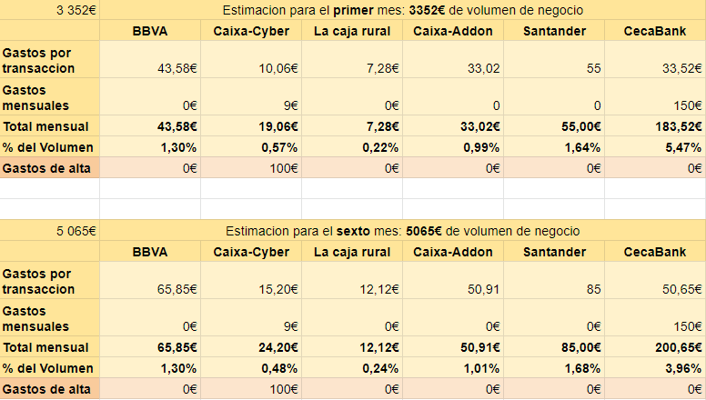
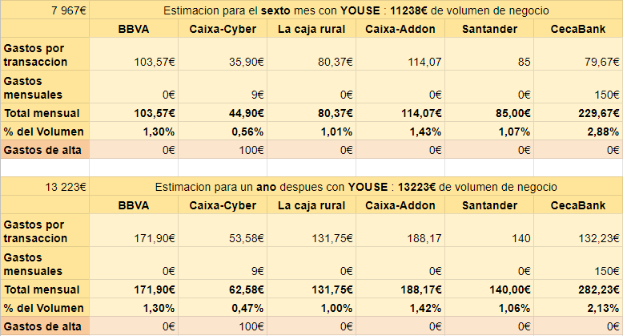
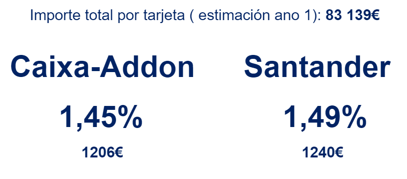

```{r setup, include=FALSE}
knitr::opts_chunk$set(echo = TRUE, warning=FALSE, message= FALSE)
```


# Estudio de los gastos para la implementacion de un TPV Virtual

Este documento presenta el estudio sobre los gastos provocados por la implementacion de un TPV Virtual.

En primer parte, podemos ver el precio de los gastos por transacciones en funcion del precio del producto que vendemos. Entonces hemos efectuado un estimacion del volumen de negocios con sus gastos.

Entonces, la ultima parte presenta los diferentes gastos de aplicacion segu los bancos.

Por fin, nuestro consejo respeto a la parte econimica. 


# Segun los precios de los productos

Para utilizar los TPV Virtual de los bancos y hacer transacion, los bancos aplican gastos por transaciones que son porcentaje de la suma de la transacion ( y con un minimo algunas veces) y hay gastos mensuales fijos para ciertos bancos.

Siguientes graficos presenten las evoluciones de lo gastos en foncion del numero de transaciones mensuales y del precio del producto.

```{r echo=FALSE}
# importation des librairies
library(plotly)
library(hrbrthemes)
# La fonction qui permet de calculer le prix
fun1 = function(prix){
  
  # CAIXA 
  
  # CyberPac
   
  x1=c(0,5,10,20,30,40,50,60,70,80,90,100)
  x2=c()
  y1=c(0,0,0,0,0,0,0,0,0,0,0,0)
  tasaCaiXa= 0.003
  minimoCaixa=0.06
  tr1Caixa=600
  tr1CaixaPrix=19
  tr2CaixaPrix=9
  trQuanti=  tr1Caixa%/%prix
  if( is.element(trQuanti,x1)==FALSE){
    x2=c(x1,trQuanti,trQuanti)
    y1=c(y1,0,0)
  }
  else{ 
    x2=c(x1,trQuanti)
    y1=c(y1,0)
  }
  x3 =sort(x2)
  for ( i in 1:length(x2)){
    if (x3[i]<=trQuanti){
      if (prix*tasaCaiXa<minimoCaixa){
        y1[i]=x3[i]*minimoCaixa*prix+tr1CaixaPrix
      }
      else {
        y1[i]=x3[i]*tasaCaiXa*prix+tr1CaixaPrix
        }
    }
    else{
      if (prix*tasaCaiXa<minimoCaixa){
        y1[i]=x3[i]*minimoCaixa*prix+tr2CaixaPrix
      }
    
      else {y1[i]=x3[i]*tasaCaiXa*prix+tr2CaixaPrix}
    }
  }
  for ( i in 1:(length(x3)-1)){
    if(x3[i]==x3[i+1]){
      y1[i+1]=x3[i+1]*tasaCaiXa*prix+tr2CaixaPrix
    }
  }
  
  #AddonPayments
  xAd1=c(0,5,10,20,30,40,50,60,70,80,90,100)
  yAd=c(0,0,0,0,0,0,0,0,0,0,0,0)
  tasaAd= 0.009
  gastoTAd=0.19
  for ( i in 1:length(xAd1)){
    yAd[i]=xAd1[i]*((tasaAd*prix) + gastoTAd)
    
  }
  
  
  
  
  
  #CAJA RURAL
  xR1=c(0,5,10,20,30,40,50,60,70,80,90,100)
  xR2=c()
  yR=c(0,0,0,0,0,0,0,0,0,0,0,0)
  tasaRural= 0.0032
  minimoRural=0.35
  tr1Rural=1500
  tr1RuralPrix=15
  tr2RuralPrix=0
  trQuantiR=  tr1Rural%/%prix
  if( is.element(trQuantiR,xR1)==FALSE){
    xR2=c(xR1,trQuantiR,trQuantiR)
    yR=c(yR,0,0)
  }
  else{ 
    xR2=c(xR1,trQuantiR)
    yR=c(yR,0)
  }
  
  xR3 =sort(xR2)
  
  for ( i in 1:length(xR2)){
    if (xR3[i]<=trQuantiR){
      if (prix*tasaRural<minimoRural){
        yR[i]=xR3[i]*minimoRural+tr1RuralPrix
      }
      else {
        yR[i]=xR3[i]*tasaRural*prix+tr1RuralPrix
        }
    }
    else{
      if (prix*tasaRural<minimoRural){
        yR[i]=xR3[i]*minimoRural+tr2RuralPrix
      }
      else {yR[i]=xR3[i]*tasaRural*prix+tr2RuralPrix}
    }
  }
  for ( i in 1:(length(xR3)-1)){
    if(xR3[i]==xR3[i+1]){
      if (prix*tasaRural<minimoRural){
        yR[i+1]=xR3[i+1]*minimoRural+tr2RuralPrix
      }
      else {yR[i+1]=xR3[i+1]*tasaRural*prix+tr2RuralPrix}
    }
    }

  
  
  #BBVA
  xBB1=c(0,5,10,20,30,40,50,60,70,80,90,100)
  yBB=c(0,0,0,0,0,0,0,0,0,0,0,0)
  tasaBBVA= 0.013
  tr1BBVA=0
  tr1BBVAPrix=0
  for ( i in 1:length(xBB1)){
    yBB[i]=xBB1[i]*tasaBBVA*prix+tr1BBVAPrix
  }
  
   
  #CecaBank
  xCe1=c(0,5,10,20,30,40,50,60,70,80,90,100)
  yCe=c(0,0,0,0,0,0,0,0,0,0,0,0)
  tasaCe= 0.01
  tr1Ce=0
  tr1CePrix=150
  for ( i in 1:length(xCe1)){
    yCe[i]=xCe1[i]*tasaCe*prix+tr1CePrix
  }
  #Santander
  xSan1=c(0,5,10,20,30,40,50,60,70,80,90,100)
  ySan=c(0,0,0,0,0,0,0,0,0,0,0,0)
  tasaSan= 0.01
  tr1San=0
  tr1SanPrix=150
  Pal1=1000%/%prix
  Pal2=2000%/%prix
  Pal3=4000%/%prix
  Pal4=8000%/%prix
  Pal5=16000%/%prix
  Pal6=25000%/%prix
  Pal=c(Pal1,Pal2,Pal3,Pal4,Pal5,Pal6)
  PrixPal=c(30,38,55,85,140,210)
  for (i in 1:6){
    if (Pal[i]<=100){
      if( (is.element(Pal[i],xSan1)==FALSE)){
        xSan1=c(xSan1,Pal[i],Pal[i])
        ySan=c(ySan,0,0)
      }
      else{ 
        xSan1=c(xSan1,Pal[i])
        ySan=c(ySan,0)
      }
    }
  }
  xSan1=sort(xSan1)
  for( i in 1:length(xSan1)){
    if (prix*xSan1[i] < 1000){ySan[i]=PrixPal[1]}
    else if (prix*xSan1[i] < 2000){ySan[i]=PrixPal[2]}
    else if (prix*xSan1[i] < 4000){ySan[i]=PrixPal[3]}
    else if (prix*xSan1[i] < 8000){ySan[i]=PrixPal[4]}
    else if (prix*xSan1[i] < 16000){ySan[i]=PrixPal[5]}
    else if (prix*xSan1[i] < 25000){ySan[i]=PrixPal[6]}
    else {ySan[i]=PrixPal[6]+ 0.011*(xSan1[i]-Pal6)*prix}
  }
  d=0
    for ( i in 1:(length(xSan1)-1)){
      
    if(xSan1[i]==xSan1[i+1]){
      d=d+1
      ySan[i]=PrixPal[d]
      
      
    }
    }
  
  
  # Permet de faire la 3 eme variable avec les noms des banques
  zBB=c()
  zc=c()
  zR=c()
  zCe=c()
  zAd=c()
  zSan=c()
  for ( i in 1:length(x2)){zc=c(zc,"Caixa - Cyber")}
  for ( i in 1:length(xBB1)){zBB=c(zBB,"BBVA")}
  for ( i in 1:length(xR2)){zR=c(zR,"Caja Rural")}
  for ( i in 1:length(xCe1)){zCe=c(zCe,"CecaBank")}
  for ( i in 1:length(xAd1)){zAd=c(zAd,"Caixa - AddonPay")}
  for ( i in 1:length(xSan1)){zSan=c(zSan,"Santander")}
  
   
# création de la data.frame
  data <- data.frame("Numero"=c(x3,xR3,xBB1,xCe1,xAd1,xSan1),"Gastos"=c(y1,yR,yBB,yCe,yAd,ySan), "Banco"=c(zc,zR,zBB,zCe,zAd,zSan))
  
  p <- data %>%
    ggplot(aes(x=Numero, y=Gastos, color=Banco))+
    scale_color_brewer(palette = "Set2")+
    geom_line()+
    geom_point(alpha=0.7, shape=21)+
    theme_light()+
      ggtitle(paste(paste("Gastos para un precio de ",prix),"€"))+
    theme(
      plot.title = element_text(size=13, color="#03224c"),
      axis.ticks.y=element_blank(),
      axis.title=element_text(colour="#03224c",size=15, face="italic", family="serif"),
      axis.text.y=element_text(colour="#03224c", family="serif")
      
  ) +
    xlab("Numero de transacciones efectuados")+ # légende des axes
    ylab("Gastos totales")
  
  ggplotly(p)
  
  
  }
  

```

### Un precio de producto 20€
```{r echo=FALSE,fig.width=6,fig.height=4}
fun1(20)
```


### Un precio de producto 50€
```{r echo=FALSE,fig.width=6,fig.height=4}
fun1(50)
```


### Un precio de producto 100€
```{r echo=FALSE,fig.width=6,fig.height=4}
fun1(100)
```


### Un precio de producto 200€
```{r echo=FALSE,fig.width=6,fig.height=4}
fun1(200)
```

### Un precio de producto 1000€
```{r echo=FALSE,fig.width=6,fig.height=4}
fun1(1000 )
```

# Estimacion de los gastos con las estimaciones de venta

En un segun tiempo, hemos realizado estimaciones de venta segun los dos productos de riegos (TAR) que podrian venderse por tarjeta. Ademas, se anadira los productos de Youse que van a venderse mayoritariamente por tarjeta.

Consideremos que solamente los nuevos clientes van pagar con tarjeta. Asi, segun los meses despues de la aplicaion del pago con tarjeta, el importe total por tarjeta va a aumentar.

```{r echo=FALSE,fig.width=6,fig.height=4 }

library(readr)
library(ggplot2)
library(dplyr)
library(plotly)
fun2 = function(banco, gastos, mes, ChAff,add){
    
  Banco1=banco
  Gastos1=gastos
  data2 <- data.frame("Banco"=Banco1,"Gastos"=Gastos1)
  
  p2<-data2 %>%
    arrange(as.numeric(Gastos))%>% # trier nos article par valeur
    mutate(Banco=factor(Banco, Banco))%>% # trier nos article par valeur
    ggplot(aes(x=Banco, y=as.numeric(Gastos))) +
      geom_segment(aes(x=Banco, xend=Banco, y=0, yend=as.numeric(Gastos)), color="#03224c")+
      geom_point( color="#f4aa42",size=2, alpha=0.6)+
      theme_light()+
      ggtitle(paste(paste("Estimacion de los gastos para el",mes),"mes"))+
      coord_flip()+
      
      theme(
            axis.title=element_text(colour="#03224c",size=15, face="italic", family="serif"),
            axis.text.y=element_text(colour="#03224c",size=15, family="serif")
            
        ) +
      xlab("Nombre del banco")+ # légende des axes
      ylab(paste("Gastos implicados por",ChAff,"€"))+
    annotate("text", x = data2$Banco[which(data2$Banco=="BBVA")], y = data2$Gastos[which(data2$Banco=="BBVA")]+add, label =paste(data2$Gastos[which(data2$Banco=="BBVA")] %>% round(2),"€"),color="orange", size=4 , angle=0, fontface="bold", hjust=0 )+
    annotate("text", x = data2$Banco[which(data2$Banco=="Caixa-Cyber")], y = data2$Gastos[which(data2$Banco=="Caixa-Cyber")]+add, label =paste(data2$Gastos[which(data2$Banco=="Caixa-Cyber")] %>% round(2),"€"),color="orange", size=4 , angle=0, fontface="bold", hjust=0 )+
    annotate("text", x = data2$Banco[which(data2$Banco=="CecaBank")], y = data2$Gastos[which(data2$Banco=="CecaBank")]+add, label =paste(data2$Gastos[which(data2$Banco=="CecaBank")] %>% round(2),"€"),color="orange", size=4 , angle=0, fontface="bold", hjust=0 )+
    annotate("text", x = data2$Banco[which(data2$Banco=="Santander")], y = data2$Gastos[which(data2$Banco=="Santander")]+add, label =paste(data2$Gastos[which(data2$Banco=="Santander")] %>% round(2),"€"),color="orange", size=4 , angle=0, fontface="bold", hjust=0 )+
    annotate("text", x = data2$Banco[which(data2$Banco=="CajaRural")], y = data2$Gastos[which(data2$Banco=="CajaRural")]+add, label =paste(data2$Gastos[which(data2$Banco=="CajaRural")] %>% round(2),"€"),color="orange", size=4 , angle=0, fontface="bold", hjust=0 )+
    annotate("text", x = data2$Banco[which(data2$Banco=="Caixa-Addon")], y = data2$Gastos[which(data2$Banco=="Caixa-Addon")]+add, label =paste(data2$Gastos[which(data2$Banco=="Caixa-Addon")] %>% round(2),"€"),color="orange", size=4 , angle=0, fontface="bold", hjust=0 )
    
  ggplotly(p2)
    
}
```


```{r echo=FALSE,fig.width=6,fig.height=4}
# fonction de calcules des frais

funC= function(An1,Se1,Tr1,M1,An2,Se2,Tr2,M2,Y1,mes,add){
  PrixB=c()
  ListBancos=c("CajaRural","BBVA","Caixa-Cyber","CecaBank","Santander","Caixa-Addon")
  Pr1An=317.6
  Pr1Se=159.8
  Pr1Tr=70.97
  Pr1M=0
  Pr2An=276.4
  Pr2Se=137.4
  Pr2Tr=137.0
  Pr2M=110.3
  PrY1=14.88
  
  
  ListNbr=c(An1,Se1,Tr1,M1,An2,Se2,Tr2,M2,Y1)
  ListPrix=c(Pr1An,Pr1Se,Pr1Tr,Pr1M,Pr2An,Pr2Se,Pr2Tr,Pr2M,PrY1)
  
  
  TasaRural=0.002
  MiniRural=0.35
  
  TasaCaixa=0.003
  MiniCaixa=0.06
  MensualGCaixa=9
  
  TasaBBVA=0.013
  
  TasaCeca=0.01
  MensualGCeca=150
  
  TasaAd=0.009
  GastoTAd=0.19
  
  TasaSan=0.013
  MensualGSan=40
  
  GastosRural=0
  GastosBBVA=0
  GastosCaixa=0
  GastosCecaBank=0
  GastosSantander=0
  GastosAd=0
  
  # CajaRural
  for ( i in 1:length(ListNbr)){
      if (ListPrix[i]*TasaRural<MiniRural){
        GastosRural=GastosRural+ListNbr[i]*MiniRural
      }
      else {
         GastosRural=GastosRural+ListNbr[i]*TasaRural*ListPrix[i]
        }
  }
  
  #Caixa
  for ( i in 1:length(ListNbr)){
      if (ListPrix[i]*TasaCaixa<MiniCaixa){
        GastosCaixa=GastosCaixa+ListNbr[i]*MiniCaixa
      }
      else {
         GastosCaixa=GastosCaixa+ListNbr[i]*TasaCaixa*ListPrix[i]
        }
  }
  GastosCaixa=GastosCaixa+MensualGCaixa
  
  #BBVA
   for ( i in 1:length(ListNbr)){
     GastosBBVA=GastosBBVA+ListNbr[i]*TasaBBVA*ListPrix[i]
        
   }
  
  #Addons
   for ( i in 1:length(ListNbr)){
     GastosAd=GastosAd+ListNbr[i]*((TasaAd*ListPrix[i])+ GastoTAd)
        
   }
  
  #Ceca
   for ( i in 1:length(ListNbr)){
     GastosCecaBank=GastosCecaBank+ListNbr[i]*TasaCeca*ListPrix[i]
        
   }
  GastosCecaBank=GastosCecaBank + MensualGCeca
  
 
  
  ChAff=0
  for (i in 1:length(ListNbr)){
    ChAff=ChAff+ListNbr[i]*ListPrix[i]
  }
  
  #Santander
  VentaPl=20
  if (ChAff< 1000){GastosSantander=10+VentaPl}
  else if (ChAff<2000){GastosSantander=18+VentaPl}
  else if (ChAff<4000){GastosSantander=35+VentaPl}
  else if (ChAff<8000){GastosSantander=65+VentaPl}
  else if (ChAff<16000){GastosSantander=120+VentaPl}
  else if (ChAff<25000){GastosSantander=190+VentaPl+20}
    
  
  
  fun2(c("BBVA","Caixa-Cyber","CecaBank","Santander","CajaRural","Caixa-Addon"), c(GastosBBVA,GastosCaixa,GastosCecaBank,GastosSantander,GastosRural,GastosAd), mes, ChAff,add)
  
}

 
``` 


### Para el Primer mes.

Consideramos:

- 9 contratos de Mediadores;

- 6 contratos de GlobalFinanz.

```{r echo=FALSE,fig.width=6,fig.height=4}

funC(5,3,1,0,3,1,1,1,0,"primer",20)


```

### Estimacion por el sexto mes despues de la aplicacion.

Consideramos:

- 17 contratos de Mediadores;

- 11 contratos de GlobalFinanz.

```{r echo=FALSE,fig.width=6,fig.height=4}

funC(6,6,5,0,3,2,3,3,0,"sexto",30)


```

### Para el sexto mes con Youse .

Consideramos ahora los productos de Youse.
Consideramos:

- 17 contratos de Mediadores;

- 11 contratos de GlobalFinanz;

- 195 contratos de Youse ( 14,88€ ).

```{r echo=FALSE,fig.width=6,fig.height=4}

funC(6,6,5,0,3,2,3,3,195,"sexto",25)


```


### Para un ano despues de la aplicacion.

Consideramos:

- 27 contratos de Mediadores;

- 17 contratos de PayementsGlobal;

- 320 contratos de Youse ( 12€ - 18€).

```{r echo=FALSE,fig.width=6,fig.height=4}

funC(11,9,7,0,6,2,4,5,320,"13",30)


```


# Los gastos de aplicacion


Los gastos de aplicacion son los gastos que pagamos al principio para la instalacion del TPV Virtual. Sin embargo, ningun bancos con lo que queremos trabajar facturan gastos de aplicacion, hay solamente la solucion Cyberpack de la Caixa que pide 100€ al principio pero no vamos a trabajar con este solucion.

```{r echo=FALSE}
library(readr)
library(ggplot2)
library(dplyr)
library(plotly)
    
Banco1=c("BBVA","Caixa-Addon","Caixa-Cyber","CecaBank","Santander","CajaRural")
Gastos1=c(0,0,100,0,0,0)
data3 <- data.frame("Banco"=Banco1,"Gastos"=Gastos1)

p3<-data3 %>%
  arrange(as.numeric(Gastos))%>% # trier nos article par valeur
  mutate(Banco=factor(Banco, Banco))%>% # trier nos article par valeur
  ggplot(aes(x=Banco, y=as.numeric(Gastos))) +
    geom_segment(aes(x=Banco, xend=Banco, y=0, yend=as.numeric(Gastos)), color="#03224c")+
    geom_point( color="#f4aa42",size=2, alpha=0.6)+
    theme_light()+
    coord_flip()+
  ggtitle("Gastos de aplicacion")+
  theme(
    axis.title=element_blank(),
    title=element_text(family="serif",colour="#03224c",size=15),
    axis.text.y=element_text(colour="#03224c",size=15, family="serif")
            
  )+
    annotate("text", x = data3$Banco[which(data3$Banco=="BBVA")], y = data3$Gastos[which(data3$Banco=="BBVA")]+10, label =paste(data3$Gastos[which(data3$Banco=="BBVA")] %>% round(2),"€"),color="orange", size=4 , angle=0, fontface="bold", hjust=0 )+
    annotate("text", x = data3$Banco[which(data3$Banco=="Caixa-Addon")], y = data3$Gastos[which(data3$Banco=="Caixa-Addon")]+10, label =paste(data3$Gastos[which(data3$Banco=="Caixa-Addon")] %>% round(2),"€"),color="orange", size=4 , angle=0, fontface="bold", hjust=0 )+
    annotate("text", x = data3$Banco[which(data3$Banco=="CecaBank")], y = data3$Gastos[which(data3$Banco=="CecaBank")]+10, label =paste(data3$Gastos[which(data3$Banco=="CecaBank")] %>% round(2),"€"),color="orange", size=4 , angle=0, fontface="bold", hjust=0 )+
    annotate("text", x = data3$Banco[which(data3$Banco=="Santander")], y = data3$Gastos[which(data3$Banco=="Santander")]+10, label =paste(data3$Gastos[which(data3$Banco=="Santander")] %>% round(2),"€"),color="orange", size=4 , angle=0, fontface="bold", hjust=0 )+
    annotate("text", x = data3$Banco[which(data3$Banco=="CajaRural")], y = data3$Gastos[which(data3$Banco=="CajaRural")]+10, label =paste(data3$Gastos[which(data3$Banco=="CajaRural")] %>% round(2),"€"),color="orange", size=4 , angle=0, fontface="bold", hjust=0 )+
    annotate("text", x = data3$Banco[which(data3$Banco=="Caixa-Cyber")], y = data3$Gastos[which(data3$Banco=="Caixa-Cyber")]+10, label =paste(data3$Gastos[which(data3$Banco=="Caixa-Cyber")] %>% round(2),"€"),color="orange", size=4 , angle=0, fontface="bold", hjust=0 )

ggplotly(p3)

```

# Conclusion


Si tomamos un estimacion para el primer ano despues de la aplicacion, aqui la comparacion de los diferentes precios.

### Estimacion SIN los productos de Youse ( 1 mes y 7 mes)



### Estimacion CON los productos de Youse ( 7 mes y 13 mes)



Con todos esas herramientas de comparacion economicas, hemos eligido 2 proveedores. Sin embargo, no podiamos elegir el banco BBVA porque no obtuvimos ninguna respuesta de ellos en cuanto a los precios reales.
Adémas, no hemos eligido Caja Rural o la solucion CyberPack de Caixa porques son TPV  muy limitados.

Asi, hemos eligido la Caixa con su solucion Addon Payment y el banco Santander con la tecnologia  Redsys.


### Los gastos durante el primer ano para Santander y la Caixa.
```{r echo=FALSE}
library(readr)
library(ggplot2)
library(dplyr)
library(plotly)
prixS=c(85,85,85,85,85,85,85,85,140,140,140,140)
prixC=c(49,58,67,78,83,96,112,114,123,134,140,152)

totalSan=0
totalCaixa=0
for ( i in 1:12){
  totalSan=totalSan+prixS[i]
  totalCaixa=totalCaixa+prixC[i]
}

x=c(1,2,3,4,5,6,7,8,9,10,11,12)
bS=c("Santander","Santander","Santander","Santander","Santander","Santander","Santander","Santander","Santander","Santander","Santander","Santander")
bC=c("Caixa","Caixa","Caixa","Caixa","Caixa","Caixa","Caixa","Caixa","Caixa","Caixa","Caixa","Caixa")
data5= data.frame("Mes"=x,"Gastos"=c(prixS,prixC), "Banco"=c(bS,bC))

 p5 <- data5 %>%
    ggplot(aes(x=Mes, y=Gastos, color=Banco))+
    scale_color_brewer(palette = "Set2")+
    geom_line()+
    geom_point(alpha=0.7, shape=21)+
    theme_light()+
      ggtitle("Gastos para el primer ano")+
    theme(
      plot.title = element_text(size=13, color="#03224c"),
      axis.text.x   =element_blank(),
      axis.title=element_text(colour="#03224c",size=15, face="italic", family="serif")
      
  ) +
    xlab("Meses")+ # légende des axes
    ylab("Gastos")
  
  ggplotly(p5)


```

Si reportamos estas cifras a lo largo de un ano,los costes incurridos representen estos porcentajes del volumen total intercambiado por tarjeta de crédito.



    